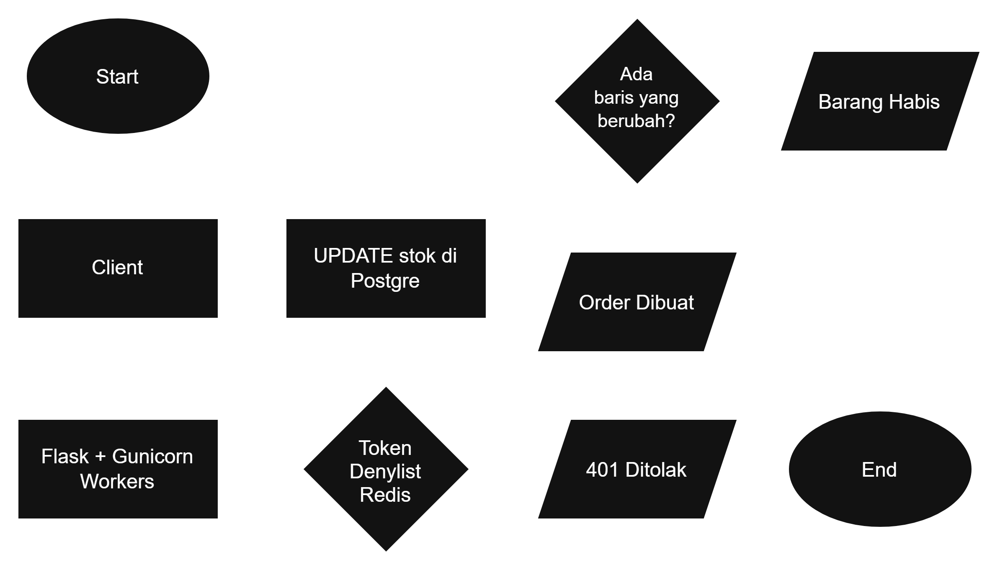

# Fulstack-work-sample-AbianPratama

## Soal #1: Optimasi Performa & State Management React

Kode ada di `src/App.jsx` (data mock 5.000 produk).

### Diagnosa: Kenapa Dashboard Bisa Lemot?

Ada dua penyebab yang saling memperparah.

**DOM terlalu berat.** Merender 5.000 baris sekaligus berarti puluhan ribu elemen HTML harus dibuat dan dikelola browser. Memori jadi besar dan render jadi lambat.

**Re-render massal.** Saat state di komponen utama berubah (misalnya stok satu produk dikurangi), React akan mengevaluasi ulang semua komponen di bawahnya. Jadi perubahan pada 1 produk membuat 4.999 produk lain ikut diperiksa ulang, padahal datanya tidak berubah.

### Solusi & Implementasi

**Virtualization (`react-window`).** Hanya baris yang terlihat di layar yang dirender ke DOM (sekitar 9 baris plus sedikit baris cadangan), sisanya baru dirender saat di-scroll. Ini yang paling besar dampaknya.

**`useCallback` dan update state per item.** Fungsi update stok dibungkus `useCallback` dan memakai `setProducts(prev => ...)`, sehingga referensinya tidak berubah antar render. Di dalam update, hanya item yang diklik yang dibuat objek baru, item lain dibiarkan sama.

**`React.memo` dengan `areRowsEqual`.** `react-window` mengirim data ke baris lewat satu objek `itemData` yang selalu baru setiap `products` berubah, jadi `React.memo` biasa tetap menganggap semua baris berubah. Karena itu saya pakai fungsi pembanding sendiri: baris hanya dirender ulang kalau data produk di barisnya memang berubah.

### Strategi State Management

Data disimpan di satu state di `App` dan diubah secara immutable hanya pada item yang berubah, sehingga baris lain tidak ikut dirender ulang. Kalau aplikasinya makin besar, bisa dipindah ke `useReducer` atau store dengan selector per item seperti Zustand.

### Pengujian

Setiap render baris mencetak log `Render baris #<id>` di console. Setelah satu kali klik tombol, dengan `React.memo` biasa muncul [ISI] log, sedangkan dengan `areRowsEqual` hanya [ISI] log.

### Cara Menjalankan

```bash
npm install
npm run dev
```

## Soal #2: Arsitektur Backend, Autentikasi JWT, & High-Concurrency Scaling

### Pilihan Tech Stack

Saya memilih **Python dengan Flask**, **PostgreSQL**, dan **Redis**. Flask ringan dan sudah biasa saya pakai, PostgreSQL bisa mengunci data stok agar tidak bentrok, dan Redis cepat untuk menyimpan data sementara seperti daftar token yang dicabut. Saat traffic naik, Flask dijalankan dengan Gunicorn beberapa worker di belakang load balancer, dan jumlahnya bisa ditambah sesuai kebutuhan.

### Token Revocation pada JWT

Token akses dibuat berumur pendek (misalnya 15 menit), jadi kalau bocor risikonya kecil. Saat logout, refresh token yang disimpan di server dihapus supaya user tidak bisa meminta token akses baru. Kalau token harus langsung tidak berlaku, ID token dicatat di daftar blokir di Redis sampai token itu kedaluwarsa, lalu dicek di setiap request. Dengan begitu hanya token yang dicabut yang perlu disimpan di server, sedangkan token lainnya tetap diperiksa tanpa menyimpan apa pun.

### Race Condition saat 100 User Membeli 1 Sisa Barang

Masalahnya terjadi kalau backend membaca stok dulu, lalu mengurangi di langkah terpisah: 100 request bisa sama-sama membaca stok = 1 dan semuanya lolos, sehingga barang terjual lebih banyak dari stoknya. Solusinya, pengecekan dan pengurangan stok digabung dalam satu query:

```sql
UPDATE products SET stock = stock - 1 WHERE id = :id AND stock > 0;
```

Kalau ada 1 baris yang berhasil diubah, pembelian berhasil dan order dibuat. Kalau 0, stok sudah habis. Saat satu request sedang mengubah data produk, PostgreSQL membuat request lain menunggu giliran, jadi request berikutnya melihat stok yang sudah terbaru dan hanya 1 dari 100 user yang berhasil. Pengurangan stok dan pembuatan order dijalankan sebagai satu paket, sehingga kalau salah satunya gagal, keduanya dibatalkan.

### Diagram Arsitektur



## Soal #3: Strategi Integrasi API, Webhook Reliability, & Resiliency

### Mencegah Transaksi Terproses Ganda (Idempotency)

Payment gateway bisa mengirim webhook yang sama lebih dari sekali, misalnya karena mencoba ulang saat koneksi bermasalah. Agar pembayaran tidak diproses dua kali, setiap webhook punya ID event unik dari gateway, dan ID itu disimpan di tabel database dengan aturan unik (tidak boleh ada yang kembar). Saat webhook masuk, backend mengecek dulu: kalau ID event sudah pernah tercatat, request langsung dijawab sukses tanpa memproses ulang. Selain itu, backend memastikan webhook benar-benar berasal dari gateway dengan memeriksa tanda tangan (signature) yang dikirim bersamanya.

### Kalau Webhook Gagal atau Tidak Sampai

Ada dua lapis pengaman. Pertama, gateway biasanya mengirim ulang webhook yang gagal beberapa kali. Kedua, backend punya tugas terjadwal (cron job) yang secara berkala mencari order yang masih berstatus "menunggu pembayaran" lebih lama dari beberapa menit, lalu menanyakan status sebenarnya langsung ke API gateway dan memperbarui order-nya. Kalau ada proses yang terus gagal, datanya dipindahkan ke antrean khusus (dead letter queue) supaya bisa dicek manual dan tidak hilang.

### Menampilkan Status Pembayaran di Frontend

Frontend React memakai polling: setiap beberapa detik (misalnya 3 detik) halaman menanyakan status order ke backend, dan berhenti begitu statusnya sudah final (berhasil atau gagal) atau setelah batas waktu tertentu. Sambil menunggu, user melihat tampilan "sedang memproses pembayaran". Cara ini sederhana dan cukup ringan karena hanya menanyakan satu order dan berhenti setelah selesai. WebSocket atau Server-Sent Events memberi update lebih instan, tapi lebih rumit dan menahan koneksi tetap terbuka, jadi untuk kasus ini polling sudah cukup.

## Soal #4: Evaluasi TCO (Total Cost of Ownership) & Trade-off Monolith vs Microservices

### Apakah Migrasi Ini Menguntungkan?

Menurut saya, untuk startup skala awal-menengah, migrasi langsung ke microservices belum menguntungkan. Aplikasi saat ini hanya berbiaya sekitar $150/bulan dan jalan dengan baik. Kalau dipindah ke Kubernetes, Lambda, dan database terkelola, biaya server hampir pasti naik (perkiraan kasarnya bisa mencapai beberapa kali lipat), dan yang lebih besar lagi adalah biaya waktu engineer. Proses migrasi bisa memakan berbulan-bulan kerja tim, padahal selama itu fitur baru yang menghasilkan pendapatan jadi tertunda. Selisih biayanya jauh lebih mahal dari penghematan atau manfaat yang didapat, terutama kalau belum ada masalah skala yang nyata.

### Biaya Tersembunyi Microservices

**Infrastruktur:** setiap service butuh deployment, monitoring, dan log sendiri. Ada tambahan biaya load balancer, API gateway, jaringan antar service, dan biasanya database yang lebih banyak.

**Tim engineering:** butuh keahlian Kubernetes dan DevOps yang belum tentu dimiliki tim, mencari bug lebih sulit karena satu request melewati banyak service, menjaga data tetap konsisten antar service lebih rumit, proses deploy dan testing lebih panjang; dan tim harus siap menangani gangguan di banyak tempat. Semua ini memperlambat pengiriman fitur.

### Rekomendasi: Modular Monolith

Aplikasi tetap satu kesatuan (satu deploy, satu database), tetapi kodenya dirapikan menjadi modul-modul yang batasnya jelas, misalnya user, produk, order, dan pembayaran, dan antar modul tidak saling mengakses sembarangan. Kalau traffic naik, cukup naikkan spesifikasi server, tambah instance, atau pasang cache (misalnya Redis). Biayanya rendah dan tim bisa tetap fokus mengirim fitur. Kalau nanti ada satu bagian yang benar-benar menjadi bottleneck (misalnya pembayaran), modul itu bisa dipisah menjadi service sendiri, karena batasnya sudah rapi. Jadi bisnis bisa berkembang bertahap sesuai kebutuhan, bukan bermigrasi sekaligus.

## Soal #5: Prioritisasi Feature, Metrik Software (LTV/CAC), & Handling Tech Debt

### Menjelaskan Technical Debt ke Product Manager

Saya akan menjelaskannya dengan bahasa bisnis, bukan bahasa kode. Daripada bilang "kodenya berantakan", saya sampaikan risikonya: "bagian ini bisa membuat server down, dan kalau terjadi saat promo, transaksi hilang dan pelanggan pergi." Saya juga menyebutkan seberapa mungkin hal itu terjadi dan apa dampaknya ke pendapatan. Setelah itu saya tawarkan beberapa pilihan beserta konsekuensinya (misalnya "kerjakan 3 fitur dengan risiko down" atau "kerjakan 2 fitur dan perbaiki bagian yang berisiko"), supaya keputusannya diambil bersama berdasarkan informasi yang jelas, bukan sekadar permintaan dari sisi engineering.

### Hubungan Kualitas Sistem dengan Churn dan LTV

Kalau sistem sering error atau lambat, pelanggan kecewa dan tidak kembali, sehingga churn rate (persentase pelanggan yang berhenti) naik. Pelanggan yang berhenti lebih cepat berarti LTV (total pendapatan dari satu pelanggan selama ia bertahan) menjadi lebih kecil. Padahal biaya untuk mendapatkan pelanggan (CAC) sudah dikeluarkan, jadi kalau pelanggan cepat pergi, biaya itu terbuang. Fitur baru memang membantu menarik pelanggan, tetapi kalau sistemnya tidak stabil, pelanggan yang sudah didapat mudah hilang lagi.

### Cara Membagi Kapasitas Sprint

Langkah yang akan saya ambil:

**Daftar dan nilai.** Semua fitur baru dan pekerjaan tech debt dicatat, lalu dinilai berdasarkan dampak bisnis, tingkat risiko, dan usaha pengerjaannya.

**Utamakan risiko tertinggi.** Tech debt yang bisa membuat server down dikerjakan lebih dulu, karena dampaknya terbesar. Debt yang kecil bisa dicicil di sprint berikutnya.

**Bagi kapasitas.** Sebagai patokan awal, kapasitas sprint dibagi sekitar 70% untuk fitur dan 30% untuk tech debt. Kalau risikonya sedang tinggi, porsi debt dinaikkan sementara.

**Sesuaikan scope fitur.** Daripada memaksakan 3 fitur penuh, dipilih fitur yang paling berpengaruh ke target CAC dan ukurannya dikecilkan (misalnya 2 fitur, atau 3 fitur versi sederhana), sehingga sisa waktunya cukup untuk memperbaiki bagian yang berisiko.